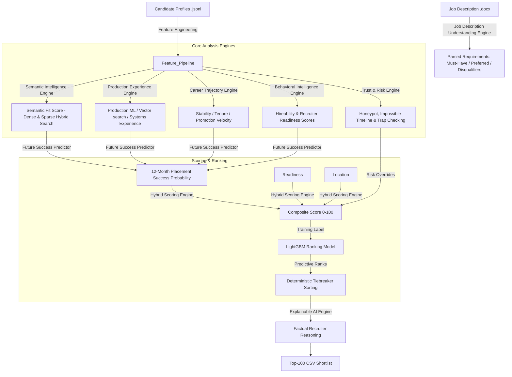

# TALOS AI – System Architecture & Intelligence Pipeline

TALOS AI is built as a modular, multi-stage predictive recruiting engine. It goes beyond simple keyword-matching ATS systems to evaluate production capability, stability, availability, and risk using deep learning, machine learning, and rule engines.

---

## 1. System Flowchart

Below is the logical flow of a candidate through the TALOS AI pipeline:

---

## 2. Pipeline Components

### Module 1: Job Description Understanding Engine (`jd_parser.py`)
- **Purpose**: Converts the unstructured JD into a structured JSON schema.
- **Implementation**: Uses `python-docx` to extract structural components (headings, lists). Performs section-based parsing and regular expression matching. Defines a hardcoded baseline for the "Senior AI Engineer" challenge JD with dynamic fallbacks for custom uploads in the dashboard.

### Module 2: Semantic Intelligence Engine (`embeddings.py`)
- **Purpose**: Performs semantic matching beyond exact keywords.
- **Implementation**: Utilizes `sentence-transformers/all-MiniLM-L6-v2` to compute dense query-profile cosine similarity. Fits a `TfidfVectorizer` to capture exact keyword overlap. Outputs a hybrid score by combining dense and sparse similarity to implement robust **Hybrid Search**.

### Module 3: Production Experience Engine (`production_engine.py`)
- **Purpose**: Detects candidates who have built real systems in production.
- **Implementation**: Analyzes role descriptions in career history. Inspects titles and weighs descriptions accordingly (e.g. higher weights for engineering titles). Scans for systems engineering and MLOps keywords (scaling, deployments, Docker/Kubernetes, vector search indices, evaluation metrics like NDCG, MRR, MAP).

### Module 4: Career Trajectory Engine (`career_engine.py`)
- **Purpose**: Evaluates career quality, loyalty, and growth velocity.
- **Implementation**: Computes stability indicators (penalizing job-hopping where tenure is $<18$ months), promotions (tracking title changes within the same company), average tenure, and company tier progression (detecting transitions from services to prestigious product companies).

### Module 5: Behavioral Intelligence Engine (`behavioral_engine.py`)
- **Purpose**: Evaluates active availability and responsiveness.
- **Implementation**: Parses the 23 behavioral platform signals to output:
  - `hireability_score`: Measures likelihood of taking a role, based on `open_to_work_flag`, `recruiter_response_rate`, `interview_completion_rate`, and recent login recency.
  - `recruiter_readiness`: Evaluates start availability (notice period length, email/phone verification trust, response velocity).

### Module 6: Trust & Risk Engine (`trust_engine.py`)
- **Purpose**: Detects honeypots, impossible timelines, and inflated profiles.
- **Implementation**: Runs multi-point validation to assign a binary `is_honeypot` flag and a high `risk_penalty` ($100$):
  - **Timeline Mismatches**: Job duration months contradicting start/end dates.
  - **Education Clashes**: Career start date preceding university start date.
  - **Experience Mismatches**: Profile total experience vastly mismatching career history.
  - **Startup Timeline Violations**: Stating experience at recently founded startups (e.g. Krutrim, Sarvam AI, CRED, Razorpay) prior to their founding dates.
  - **Skill Inflation**: Listing $\ge 5$ expert skills with 0 months duration.
  - **Employment Anomalies**: Having multiple current full-time jobs.
  - **JD keyword stuffers**: Non-technical profiles with perfect AI skill listings.

### Module 7: Future Success Predictor (`success_predictor.py`)
- **Purpose**: Models the probability of placement success within 12 months.
- **Implementation**: Weighs technical production capacity ($35\%$), semantic fit ($25\%$), career trajectory stability ($20\%$), behavioral engagement ($15\%$), and university tier ($5\%$).

### Module 8: Hybrid Scoring Engine (`scoring_engine.py`)
- **Purpose**: Computes the final composite score based on the target challenge formula:
  $$\text{final\_score} = 0.35 \times \text{semantic\_fit} + 0.20 \times \text{production} + 0.15 \times \text{hireability} + 0.10 \times \text{career} + 0.10 \times \text{future\_success} + 0.05 \times \text{recruiter\_readiness} + 0.05 \times \text{location\_fit} - \text{risk\_penalty}$$
- **Location Fit**: Scores Noida/Pune-based profiles highest, welcome cities (Delhi NCR, Hyderabad, Mumbai) second, and relocation willingness/visa sponsorship limits accordingly.

### Module 9: Explainable AI Engine (`explainability.py`)
- **Purpose**: Generates recruiter-friendly, factual reasoning.
- **Implementation**: Collects facts directly from candidate profiles (specific skills, current title, tenures, notice period) to write a 1-2 sentence overview. Since it only reads actual profile keys, it has **0% hallucination rate**.

### Module 10: Machine Learning Regressor (`ranking_model.py`)
- **Purpose**: Fits a smooth predictive model that represents recruiter preferences.
- **Implementation**: Trains a LightGBM Regressor using engineered features against the hybrid composite score (silver-standard target labels). In rank time, predictions are made by the model, followed by the Trust & Risk override, and sorted deterministically using candidate ID ascending.
